# intracranial_contact_loc
[](https://doi.org/10.5281/zenodo.14217838)
[](https://ganshengt.github.io/intracranial_contact_loc/)

This repository includes algorithms in MATLAB for localizing intracranial contact. CT images, MRI images, and freesurfer software are required.

Updates:
2025 Aug 19, I developed an automated pipeline for estimating intracranial electrode location based on CT images and manufacture information of the electrode lead. The main script has been tested on DIXI electrodes.

## Installation
```bash
git clone https://github.com/GanshengT/intracranial_contact_loc.git
cd intracranial_contact_loc
```

## Motivation and objective
**Electrode localization** refers to identifying the precise anatomical positions of implanted intracranial electrodes.  
This step is essential in both **clinical practice** and **neuroscience research**:

- **Clinical applications**:  
  - Mapping eloquent cortex for surgical planning.  
  - Delineating seizure onset zones in patients with epilepsy.  
  - Guiding resection or stimulation strategies with minimal risk.  

- **Research applications**:  
  - Linking electrophysiological signals to anatomical structures.  
  - Understanding network-level dynamics of cognition and disease.  
  - Enabling reproducible and anatomically grounded scientific discovery.  

<p align="center">
  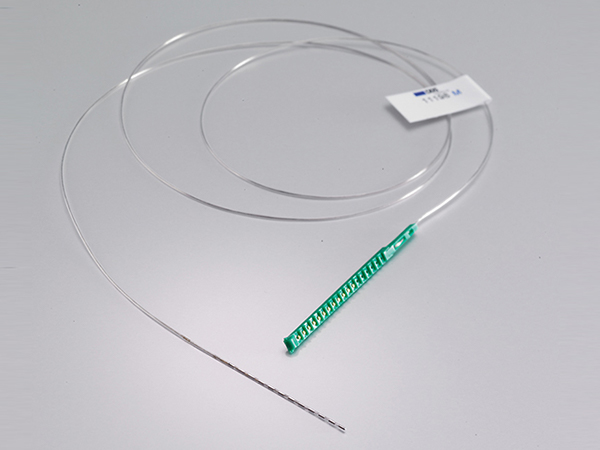
</p>
*Figure: An example of iEEG elecrtode* 

Precise and **objective localization** is thus critical. However, most workflows still rely heavily on **manual localization**, which presents two major limitations:  

1. **Subjectivity** – human raters must distinguish contacts on CT scans that often suffer from streak artifacts and noisy intensity. For example, an isosurface in FreeSurfer may appear as a continuous lead, making individual contacts ambiguous.  
2. **Time-consuming and error-prone** – manual tracing and labeling are labor-intensive, and mistakes can propagate through analysis pipelines.  

To address these issues, **v1.0** of this pipeline introduced an automated approach that leverages CT intensity and a connected-graph searching algorithm to identify electrode contacts.  

Building on this foundation, **v2.0** incorporates **electrode manufacturing specifications** to further improve robustness. By exploiting the known geometry of linear electrode leads, the algorithm can fit multiple contacts simultaneously, mitigating the impact of noisy voxels and imaging artifacts. This allows faster, more accurate, and reproducible electrode localization for both clinical and research use cases.

## Methods
### step 1: metal identification
Our automated electrode localization approach begins by analyzing the CT intensity distribution.  
We identify peaks corresponding to metal contacts, which allows us to select candidate voxels associated with the electrode lead.

<p align="center">
  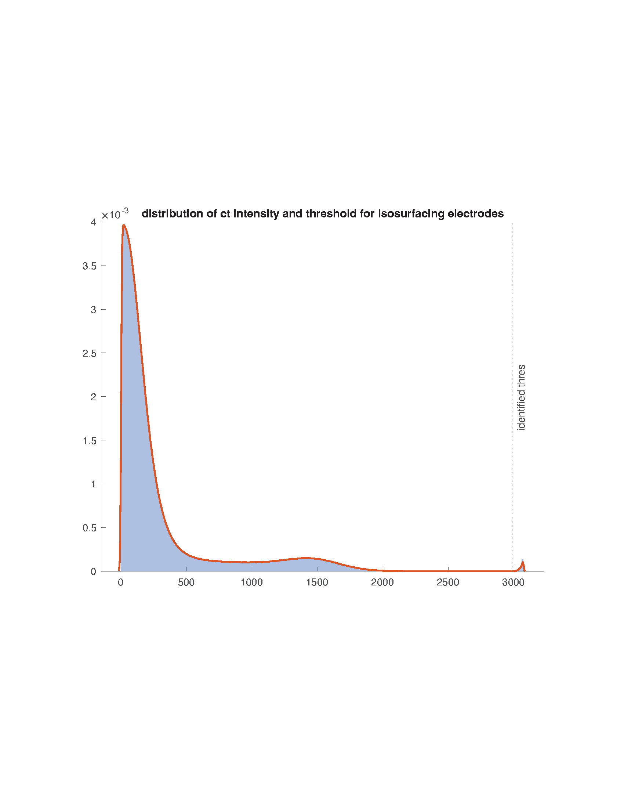
</p>

*Figure: Example CT intensity distribution. We find peaks with prominance higher than the noise. The right peak correspond to metal voxels*  

### step 2-1: lead identification
We visualize the **metal voxel isosurface** to sanity-check the threshold and the spatial distribution of metal (contacts + lead body). We also overlay the **planned trajectory** (exported from ROSA) and restrict analysis to voxels that lie within a **cylindrical neighborhood** of this line segment. This (i) suppresses unrelated metal (e.g., screws/plates) and (ii) disambiguates adjacent leads.

**Note on ROSA coordinates:** Ensure the ROSA trajectory is in **the same RAS frame** as the CT used for localization. Co registration is needed

<p align="center">
  <a href="figs/BJH079_ct_rotation_traj_R_and_metal_voxels.mp4">
    
  </a>
</p>

*Click the image to watch the rotation video.*

<p align="center">
  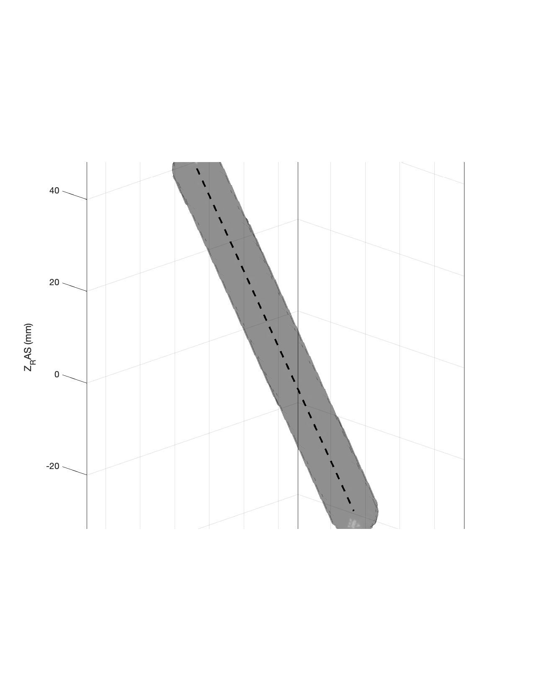
</p>

*Figure: Extracted metal voxels and the planned trajectory for one lead*  

### step 2-2: seed growing algorithm for lead identification

<p align="center">
  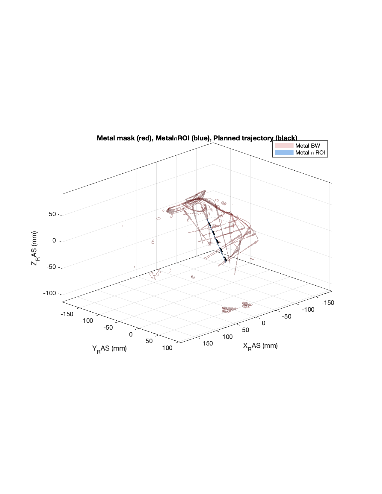
</p>
*Figure: metal voxels within the cyliner around the planned trajctory*  

From the set of metal voxels near the planned trajectory, we employed a seed-growing algorithm to isolate the voxels corresponding to the intended lead. The main objective is to disambiguate this lead from neighboring electrodes or unrelated metal.

To achieve this, multiple seeds are initialized within the metal cluster, and each seed iteratively expands its voxel pool. At each step, a neighboring voxel is added if it lies close to the centroid of the current pool, thereby maintaining a coherent and compact structure.

To prevent growth onto adjacent leads, we evaluate the filling ratio of a cylindrical tube aligned with the planned trajectory and encompassing the current voxel pool. Because different leads typically have offsets or angular deviations relative to the planned path, including voxels from another lead would substantially reduce the cylinder’s filling ratio. This provides a natural safeguard against erroneous extension across multiple leads.

<p align="center">
  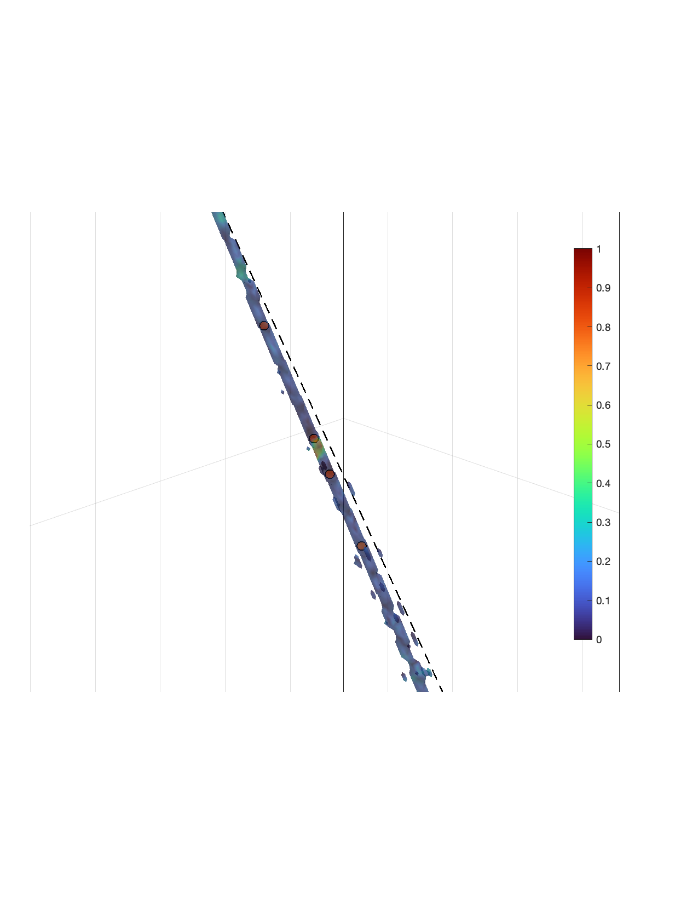
</p>
*Figure: seed growing algorithm to map out exact voxels corresponding to this lead. Colors represent intensity and circle representing initial seeds* 

<p align="center">
  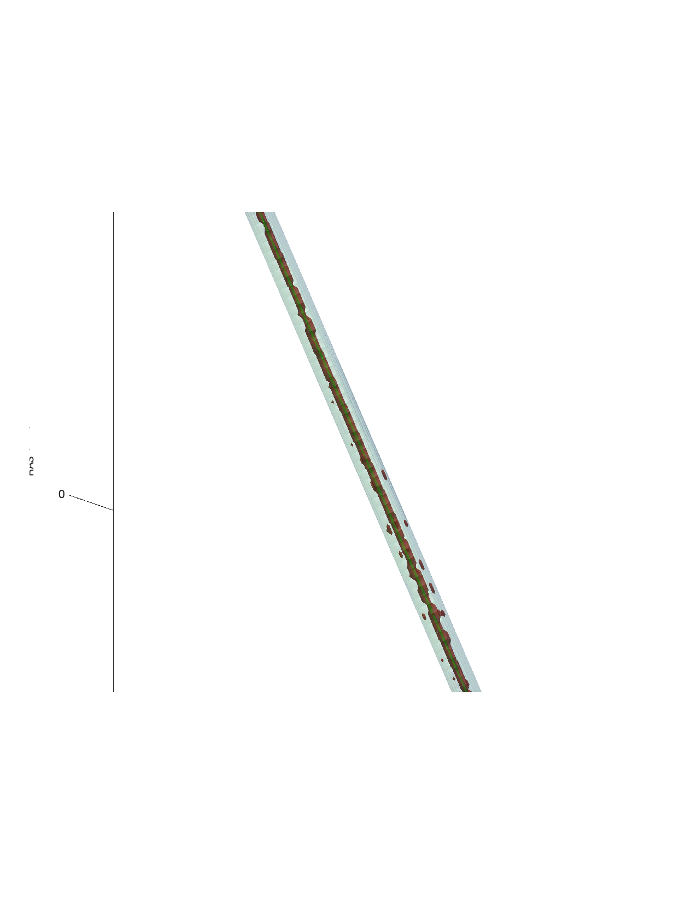
</p>
*Figure: example of a tube fitting* 

Furthermore, we identify the proximal entry point and the most distal point based on segmenting the brain from the CT. We checked the interception between the identified lead voxel and the brain mask and check which direction (between the two end points, that is, the interception point and the distal point) align with the boundary to center vectors from the brain mask.

<p align="center">
  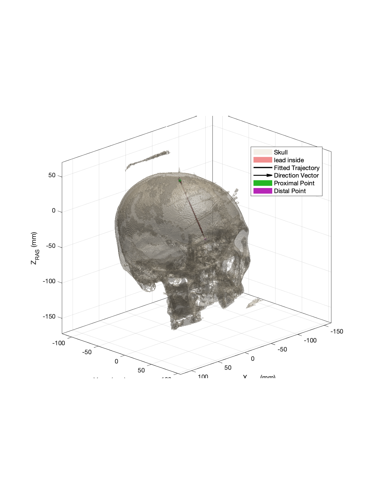
</p>
*Figure: example of identified lead voxels, proximal and distal points 

### step 2-3: isolating the lead of interest (in case two trajectory are crossing)
In rare occasion, two trajectories were very close. For clinical reason, it is usually not ideal to have two parallel leads that are close (because the regions are already covered by one lead).

Therefore, we implement a novel algorithm based on global coherence. Global coherence is defined as the cosine similarity of directions for vectors between a voxel of interest and other voxels (that are further from this voxel, which is identified by distance percentile). In this scenario, voxels that belong to one lead will have higher global coherence as the vectors between this voxel and other voxels follow the lead direction.

<p align="center">
  
</p>
*Figure: additional processing for isolating the lead of interest*  

### step 3: modeling lead as a linear or bezier function
<p align="center">
  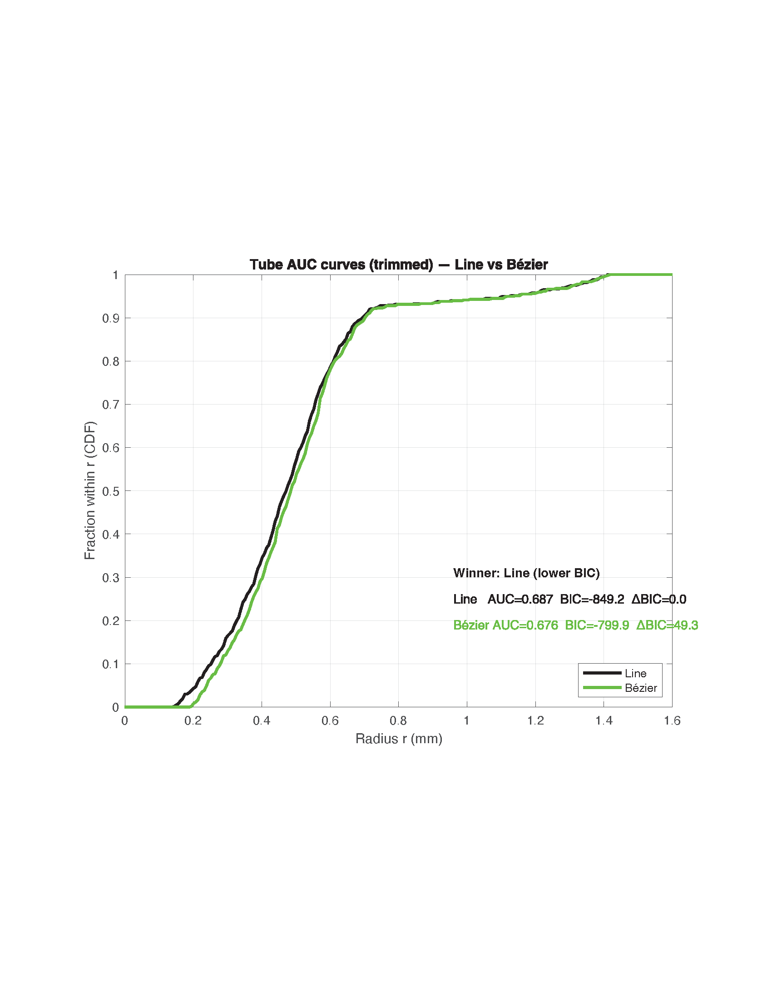
</p>
*Figure: example of roc curve, the curve shows how many voxels is included if increase the radius of a tube along a linear line or a bezier function. A negative BIC change from linear Bezier will suggest bending during the lead implentation. For 99% lead implented in WashU, the lead is straight and can be modelled with a linear function.

### step 4: electrode localization

After modeling the lead, we calculate electrode likelihood along the modelled line/curve. An electrode can be modelled by a cylinder with radius and length. For each location, we subtract the background (outter shell) CT intensity from the elecrtode cylinder intensity as the electrode likelihood.

<p align="center">
  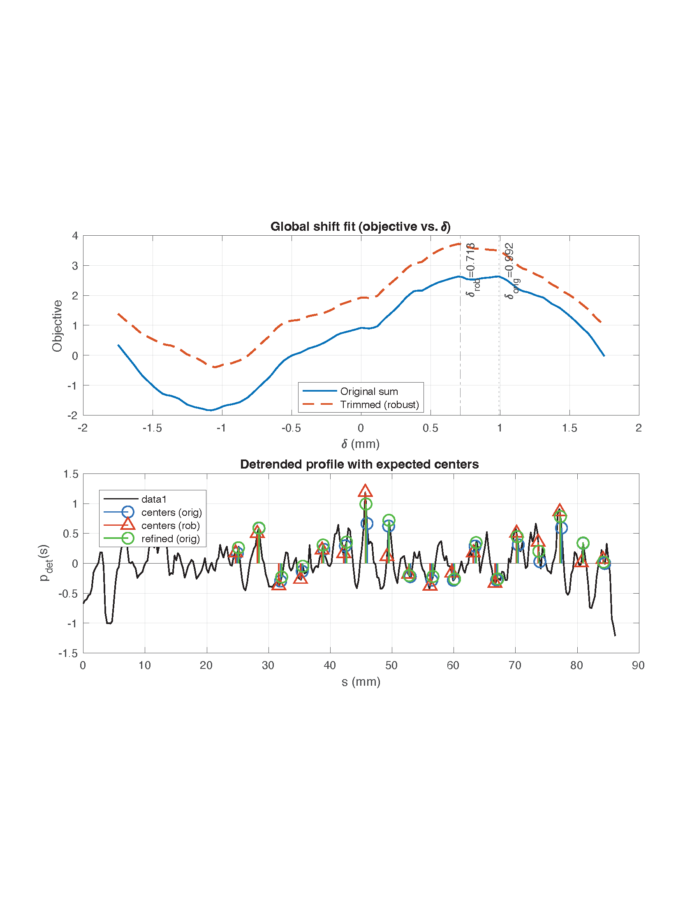
</p>
*Figure: Electrode likelihood along the lead model. This curve is calculated from the lead shown above where humans eyes can not identify contacts from the CT images (the lead present itself as a continuous bright streak).

<p align="center">
  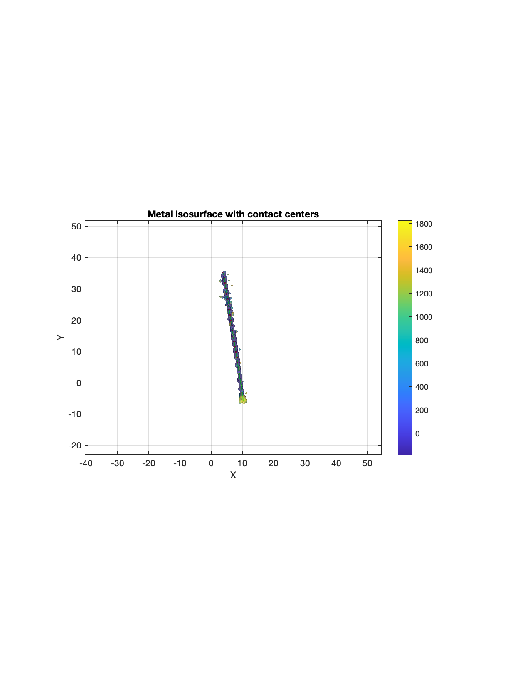
</p>
*Figure: We used the electrode spacing from the manufacturer and performed global shift to estimate electrode locations such that the electrodes location overlay with maximum elecrtode likelihood.

<p align="center">
  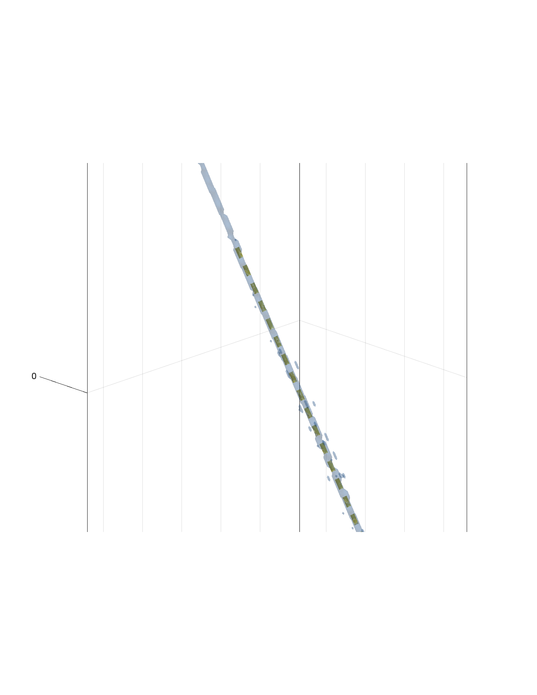
</p>
*Figure: 3D rendering of the electrodes and metal voxels identified from CT imagings.

Most of the time, the lead is presented as segmented line in the CT images, where electrodes are separated. Below is an example of a typical lead in CT images.

<p align="center">
  
</p>
*Figure: Electrode likelihood along the lead model. This curve is calculated from the lead shown above where humans eyes can not identify contacts from the CT images (the lead present itself as a continuous bright streak).

<p align="center">
  
</p>
*Figure: We used the electrode spacing from the manufacturer and performed global shift to estimate electrode locations such that the electrodes location overlay with maximum elecrtode likelihood. The green line represents the fitted lead model and the red dots represented identified electrodes.

<p align="center">
  
</p>
*Figure: 3D rendering of the electrodes and metal voxels identified from CT imagings.

### Validation

<p align="center">
  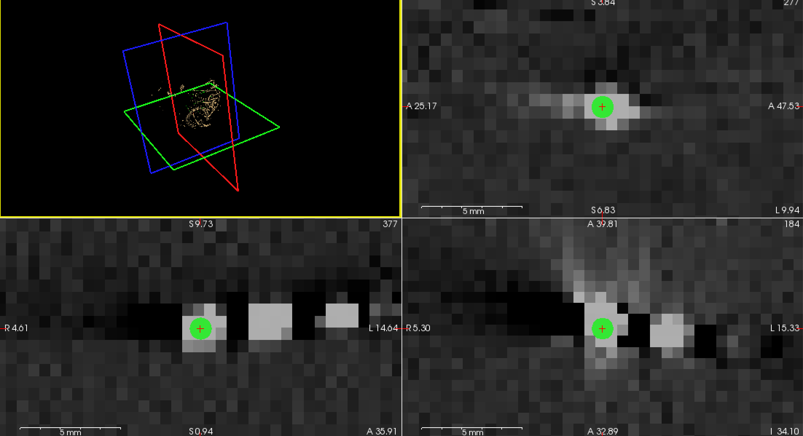
</p>
*Figure: The localization results are validated in freesurfer.

## Updates Sep 3
We have updated the method for estimating the most probable location for electrodes.
The main update is defining a core and shell, the most probable location for an electrode is the location where the voxel intensity in the core is greater than the voxel intensity in the shell.
The core is modeled to be a cylinder having the dimension provided by the manufacture
The shell is defined to be a cylinder encompassing the core, which cover the insulating space (space between two electrodes), and the annulus surrounding the core (to capture the streak artifact resulting from metals in CT imaging)

<p align="center">
  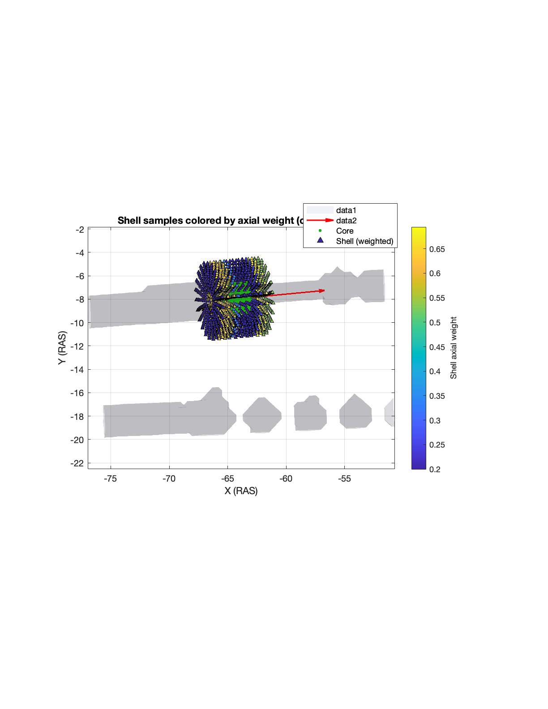
</p>
*Figure: Visualization of the modelled shell and core.

This method improves the localization of electrode contacts even when CT images are noisy (aka, the scattering of the electrode obscures the boundary between electrodes, making the lead a non-segmented streak).
<p align="center">
  
</p>
*Figure: Updated elecrtode location estimation method can better identify electrode location in sinarios where individual contacts are not visually separable from each other.

We also created new function for localization of DIXI MICRODEEP® MICRO-MACRO DEPTH ELECTRODES
This is done by locating all macro-contacts and retain the functioning ones based on the electrode types: 6 macro-contacts / 3 tetrodes (12 micro-contacts)
9 macro-contacts / 2 tetrodes (8 micro-contacts).

<p align="center">
  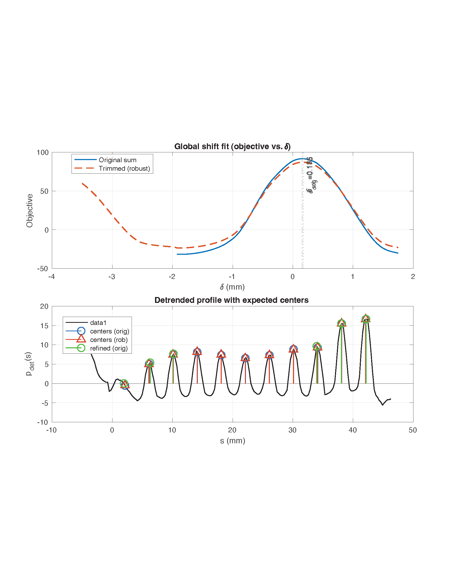
</p>
*Figure: Localization of macro contacts on MME leads, there are 5 non-functioning macro contact on the lead. These contacts are to maintain the electrode “semi-ridged” design

<p align="center">
  
</p>
*Figure: Reconstructed electrodes based on estimated locations, overlaid on top of the metal surface generated based on CT imaging.

## Tutorial
Please use this link (https://ganshengt.github.io/intracranial_contact_loc/) for detailed documentation.


